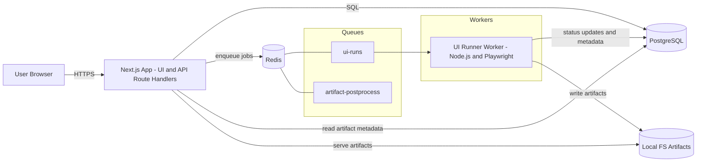
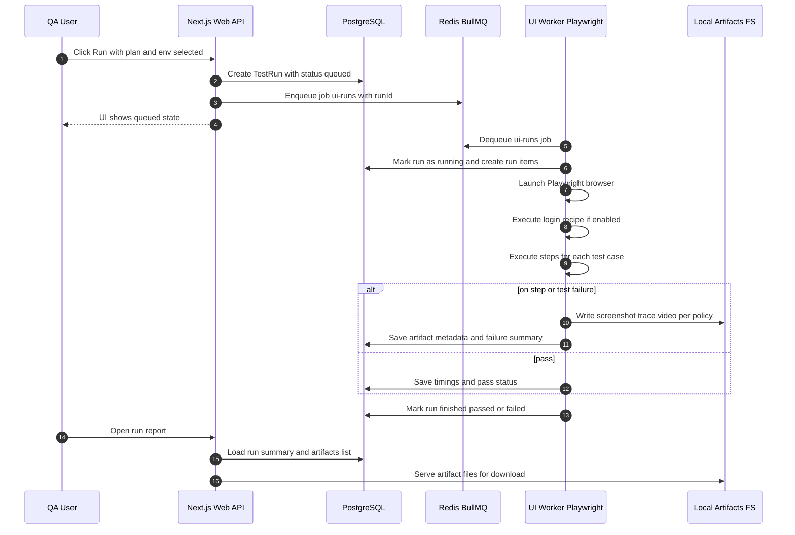

# TestForge — Architecture Diagram (v1)

This document contains the **system architecture** for TestForge v1 (UI-first).

## 1) High-level component diagram

## 2) Sequence: "Run Test Plan"

## 3) Key runtime concerns
- **Concurrency control:** configured in worker + BullMQ; start low (1–2 browsers per VM).
- **Flakiness controls:** retries, trace-on-failure, selector linting.
- **Security:** secrets encrypted at rest; never return to UI after save.
